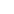

## USERS

What is the personnality of the web site
Define systems

## Style

- Font

  font-family: "Sono", sans-serif;

## Color Palette

General

- button : #413b51
- Highlight: rgb(255, 189, 8)
- Form text:#292534

## Todo item hover color

#413b51

## icon Highlight

#d0c9e2

## Action

Done
Due today
Overdue
Due Tomorrow
Upcoming and number of day
Archive

## Features

sort the date late date
Alarm to alert user

## Formula

dateBetween(deadline(),dateNow()) < -1 --> action= Archive

if the deadline is today then return Due today

if the deadline is in the past then return overdue

if the deadline is tomorrow then return due tomorrow

if the deadline is within the next week then return delta this week and find day of week

05:57.988

## templates

`<li class="todo_LI" data-itemID=${itemId}>

  

    

      <ul class="todo_nav_bar">
        <li class="deadline_container">
          
          <label for="">Deadline</label><input class="deadline_date" type="date" />
        </li>
        <li class="status_container">
          
          <label for="">Done</label>
          <input class="input_status" type="checkbox" />
        </li>
        <li class="tag_container">Tag<input class="input_edit_tag hide_input_edit_tag" type="text" value="" placeholder=" enter a tag name" />

</li>
      </ul>
    

    <h3>${item.title}</h3>
    
${item.description}

    
${item.dealine}

    delete
  

  

<ul class="tags_list"><li class="tag_style">test<li><li>test<li></ul>
<progress class="progress_bar" value="50" max="100"></progress>

${item.daysleft} day left 

</li>`
